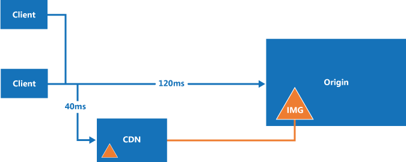

# ASP.NET Core CDN helpers

[](https://ci.appveyor.com/project/madskristensen/webessentials-aspnetcore-cdntaghelpers)
[](https://nuget.org/packages/WebEssentials.AspNetCore.CdnTagHelpers/)

This NuGet package makes it painless to use a Content Delivery Network (CDN) to serve static files from any ASP.NET Core web application.

Using a CDN to serve static resoruces (JS, CSS and image files) can significantly speed up the delivery of content to your users by serving those resources from edge servers located in data centers around the world. This reduces latency by a wide margin.



Using a CDN has never been cheaper and with this NuGet package it is now super easy to set up.

Read more about [Content Delivery Networks here](https://docs.microsoft.com/en-us/azure/architecture/best-practices/cdn).

## Getting started
It's easy to use a CDN in your ASP.NET Core web application. Here's how to get started.

### 1. Setup a CDN
We recommend you use the Azure CDN ([try it for free now](https://azure.microsoft.com/en-us/free/?utm_source=github&utm_medium=referral&utm_campaign=wt-cdntaghelpers)), but any CDN supporting *reverse proxying* or *origin push* will work.

> Keep in mind that you don't need to host your website on Azure in order to use the Azure CDN.

When using the Azure CDN, you will get an endpoint URL that looks something like this: `https://myname.azureedge.net`. You need that URL in step 2.

### 2. Register the Tag Helpers
Do that by adding this line to the **_ViewImports.cshtml** file:

```csharp
@addTagHelper *, WebEssentials.AspNetCore.CdnTagHelpers
```

Then add he CDN url to the appsettings.json file:

```json
{
  "cdn": {
    "url": "https://myname.azureedge.net"
  }
}
```

That's it. Now all your static assets are being requested directly from the CDN instead of locally from your website.

### 3. Verify it works
Run the page in the browser and make sure that all JavaScript, CSS and image references have been modified to now point to the CDN.

You can do that by looking at the HTML source code. There should no longer by any relative file references, like this one:

```html
<script src="js/site.js"></script>
```

...but instead it should look like this:

```html
<script src="https://myname.azureedge.net/js/site.js"></script>
```

## Configuration
Use the **appsettings.json** file to store the configuration settings.

```json
{
  "cdn": {
    "url": "https://myname.azureedge.net",
    "prefetch": true
  }
}
```

That makes it easy to disable CDN locally when developing and only enable it in production by adding the config to the **appsettings.production.json** file.

**url**: An absolute URL that is used to prefix all static file references with.

**prefetch**: Will by default inject a DNS prefetch link to the `<head>` of the document to speed up the DNS resolution. Set to `false` to disable.